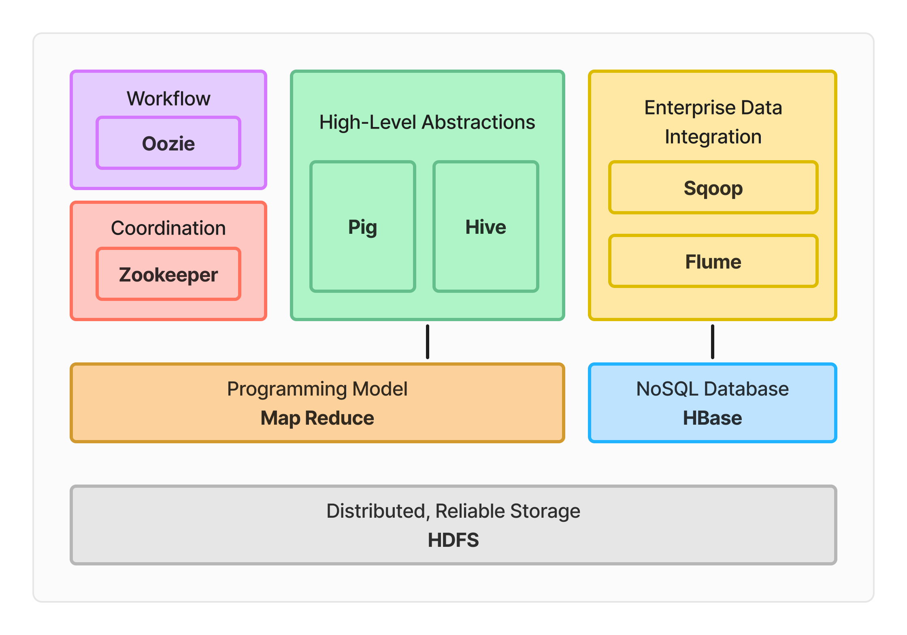

# Hadoop Ecosystem 

## Overview

The Hadoop ecosystem is a comprehensive suite of tools and technologies designed to handle large-scale data processing, storage, and analytics. At its core, Hadoop is an open-source, distributed computing framework that enables the processing of vast amounts of data across a cluster of computers.

## Components of the Hadoop Ecosystem

### 1. Hadoop Distributed File System (HDFS)

HDFS is a distributed storage system that allows data to be stored across multiple machines in a cluster. It provides a scalable and fault-tolerant way to store large amounts of data.

### 2. MapReduce

MapReduce is a programming model used for processing large data sets in parallel across a cluster of computers. It consists of two main components: the mapper and the reducer.

### 3. YARN (Yet Another Resource Negotiator)

YARN is a resource management layer that manages resources and schedules jobs (applications) on the Hadoop cluster.

### 4. Apache Pig

Apache Pig is a high-level data processing language and framework that allows users to write data analysis programs in a Pig Latin language.

### 5. Apache Hive

Apache Hive is a data warehousing and SQL-like query language for Hadoop. It allows users to write queries in a familiar SQL syntax and execute them on Hadoop data.

### 6. Apache Spark

Apache Spark is an in-memory data processing engine that provides high-performance processing of large-scale data sets.

### 7. Apache Flume

Apache Flume is a distributed, reliable, and available system for efficiently collecting, aggregating, and moving large amounts of log data from many different sources to a centralized data store.

### 8. Apache Sqoop

Apache Sqoop is a tool designed for efficiently transferring bulk data between Hadoop and structured data stores such as relational databases.

### 9. Apache Oozie

Apache Oozie is a workflow scheduler system that manages Hadoop jobs.

### 10. HBase

HBase is a NoSQL, distributed, column-family NoSQL database built on top of Hadoop. It provides a fault-tolerant and scalable way to store large amounts of semi-structured and structured data.

## Use Cases

* Data Integration: Hadoop can be used to integrate data from various sources, such as social media, sensors, and logs.
* Data Analytics: Hadoop can be used to analyze large amounts of data to gain insights and make informed decisions.
* Data Science: Hadoop can be used to build machine learning models and perform data science tasks.

## Getting Started

To get started with the Hadoop ecosystem, follow these steps:

1. Install Hadoop on your machine or cluster.
2. Learn the basics of Hadoop, including HDFS, MapReduce, and YARN.
3. Explore the various tools and technologies in the Hadoop ecosystem, such as Pig, Hive, and Spark.
4. Practice using Hadoop by working on projects and tutorials.

## Resources

* Apache Hadoop Documentation: <https://hadoop.apache.org/docs/>
* Hadoop Tutorials: <https://hadoop.apache.org/docs/current/hadoop-project-dist/hadoop-common/Tutorial.html>
* Hadoop Books: <https://hadoop.apache.org/docs/current/hadoop-project-dist/hadoop-common/Books.html>