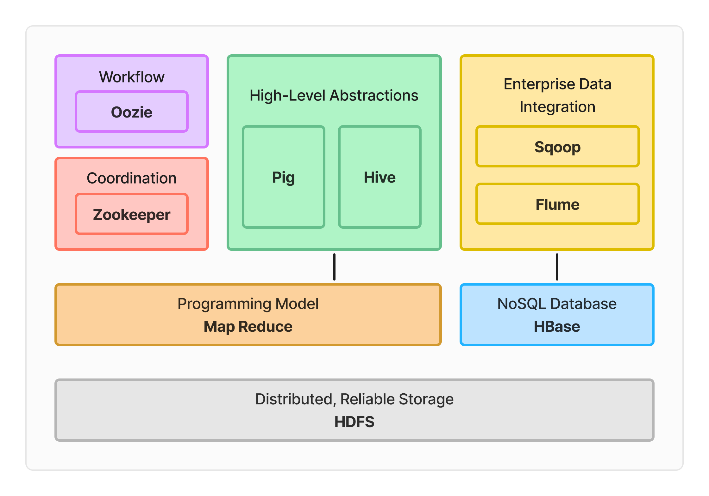

# Hadoop Ecosystem Core Components

The Hadoop ecosystem is a comprehensive framework for storing, processing, and analyzing large datasets. It consists of several core components that work together to provide a scalable and fault-tolerant platform for big data processing.

## 1. Hadoop Distributed File System (HDFS)

*   **Distributed Storage**: HDFS is a distributed storage system that allows data to be stored across multiple machines in a cluster.
*   **Scalability**: HDFS provides a scalable way to store large amounts of data.
*   **Fault-Tolerance**: HDFS is designed to be fault-tolerant, ensuring that data is always available even in the event of hardware failures.

HDFS is the primary storage system used by Hadoop applications. It provides a reliable and efficient way to store and retrieve large datasets.

## 2. MapReduce

*   **Programming Model**: MapReduce is a programming model used for processing large data sets in parallel across a cluster of computers.
*   **Mapper**: The mapper is responsible for processing input data and producing output in the form of key-value pairs.
*   **Reducer**: The reducer is responsible for aggregating the output from the mapper and producing the final output.

MapReduce is a fundamental component of the Hadoop ecosystem, providing a flexible and scalable way to process large datasets.

## 3. YARN (Yet Another Resource Negotiator)

*   **Resource Management**: YARN is a resource management layer that manages resources and schedules jobs (applications) on the Hadoop cluster.
*   **Job Scheduling**: YARN provides a flexible and scalable way to schedule jobs on the Hadoop cluster.
*   **Resource Allocation**: YARN manages resource allocation for jobs, ensuring that resources are allocated efficiently.

YARN is a critical component of the Hadoop ecosystem, providing a scalable and efficient way to manage resources and schedule jobs.

## 4. Apache Pig

*   **High-Level Language**: Apache Pig is a high-level data processing language and framework that allows users to write data analysis programs in a Pig Latin language.
*   **Data Analysis**: Pig provides a flexible and scalable way to analyze large datasets.
*   **Data Transformation**: Pig provides a range of data transformation operators, making it easy to transform and process data.

Apache Pig is a popular component of the Hadoop ecosystem, providing a high-level language for data analysis and processing.

## 5. Apache Hive

*   **Data Warehousing**: Apache Hive is a data warehousing and SQL-like query language for Hadoop.
*   **SQL Support**: Hive provides support for SQL queries, making it easy to analyze and process data.
*   **Data Storage**: Hive provides a flexible and scalable way to store and manage data.

Apache Hive is a critical component of the Hadoop ecosystem, providing a data warehousing and SQL-like query language for Hadoop.

## 6. Apache HBase

*   **NoSQL Database**: Apache HBase is a NoSQL database that provides a scalable and fault-tolerant way to store large amounts of data.
*   **Column-Oriented Storage**: HBase provides a column-oriented storage model, making it ideal for applications that require fast data retrieval.
*   **Real-Time Data Processing**: HBase provides real-time data processing capabilities, making it ideal for applications that require fast data processing.

Apache HBase is a popular component of the Hadoop ecosystem, providing a scalable and fault-tolerant way to store large amounts of data.

## 7. Apache Flume

*   **Data Ingestion**: Apache Flume is a data ingestion tool that provides a reliable and efficient way to collect, aggregate, and move large amounts of data.
*   **Data Processing**: Flume provides a range of data processing capabilities, making it easy to transform and process data.
*   **Data Storage**: Flume provides a flexible and scalable way to store and manage data.

Apache Flume is a critical component of the Hadoop ecosystem, providing a reliable and efficient way to collect, aggregate, and move large amounts of data.

## 8. Apache Sqoop

*   **Data Transfer**: Apache Sqoop is a data transfer tool that provides a reliable and efficient way to transfer data between Hadoop and relational databases.
*   **Data Import**: Sqoop provides a range of data import capabilities, making it easy to import data from relational databases into Hadoop.
*   **Data Export**: Sqoop provides a range of data export capabilities, making it easy to export data from Hadoop to relational databases.

Apache Sqoop is a popular component of the Hadoop ecosystem, providing a reliable and efficient way to transfer data between Hadoop and relational databases.

## 9. Apache Oozie

*   **Workflow Management**: Apache Oozie is a workflow management tool that provides a reliable and efficient way to manage and coordinate workflows in Hadoop.
*   **Job Scheduling**: Oozie provides a range of job scheduling capabilities, making it easy to schedule and manage jobs in Hadoop.
*   **Workflow Coordination**: Oozie provides a range of workflow coordination capabilities, making it easy to coordinate and manage workflows in Hadoop.

Apache Oozie is a critical component of the Hadoop ecosystem, providing a reliable and efficient way to manage and coordinate workflows in Hadoop.

## 10. Apache ZooKeeper

*   **Configuration Management**: Apache ZooKeeper is a configuration management tool that provides a reliable and efficient way to manage and coordinate configuration data in Hadoop.
*   **Naming Service**: ZooKeeper provides a range of naming service capabilities, making it easy to manage and coordinate naming data in Hadoop.
*   **Locking Service**: ZooKeeper provides a range of locking service capabilities, making it easy to manage and coordinate locking data in Hadoop.

Apache ZooKeeper is a popular component of the Hadoop ecosystem, providing a reliable and efficient way to manage and coordinate configuration data in Hadoop.

# Newer Capabilities and Components

### 1. Whirr

Whirr is a set of libraries that enables users to easily deploy Hadoop clusters on various cloud platforms, including Amazon EC2 and Rackspace, as well as any virtual infrastructure.

### 2. Mahout

Mahout is a machine-learning and data-mining library that provides MapReduce implementations for popular algorithms used in clustering, regression testing, and statistical modeling.

### 3. BigTop

BigTop is a formal process and framework for packaging and interoperability testing of Hadoop's sub-projects and related components.

### 4. Ambari

Ambari is a project aimed at simplifying Hadoop management by providing support for provisioning, managing, and monitoring Hadoop clusters.